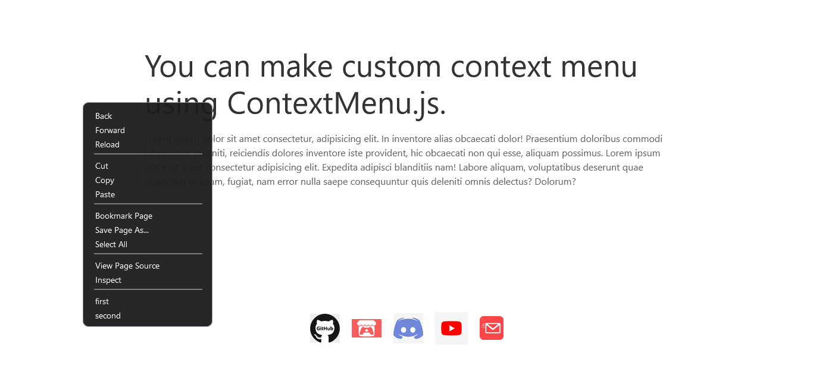
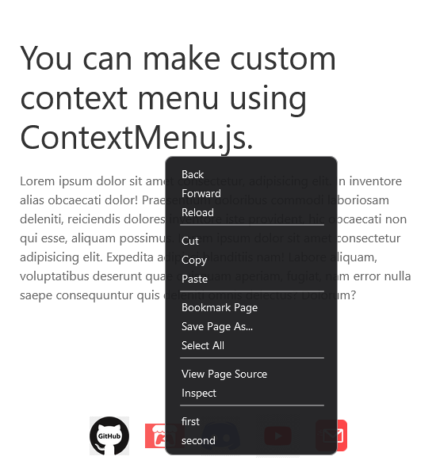

# ContextMenu.js

<div align="center">
    <i> What something cool like custom context menu in your website or npm app.
    ContextMenu.js is fully customizable, you can use any css framework to customize it. You can make fast context menus using this. ContextMenu.js is best choice for your node app and your website. I am continuously working to improve this.<br>
    Thanks!<br> <br> </i>
    
     <br> <br>
    
    
    
     <br>
    
    
</div>

<br>
<br>

## Pros

- Single File

- Lightweight

- No Dependencies

- Blazing Fast

- Works on any device including android and ios.

## Cons

- Known none till now.

## Screenshots

 \


# Documentation

```Javascript
let menu = new ContextMenu({
    removeDefaultMenu: false,
    addAtLast: true,
    menu: [
        {
            seperator: true,
        },
        {
            name: "first",
            cmd: "ContextMenuFunction.reloadPage()"
        },
        {
            name: "second",
            cmd: "ContextMenuFunction.reloadPage()"
        },
    ]
});
```

- Include the ContextMenu.js or ContextMenu.min.js.

- removeDefaultMenu :- (takes boolean) removes the default menu.

- addAtLast :- (takes boolean) adds your custom menu at last if `removeDefaultMenu = false`

- menu :- (array of objects) custom menu structure.
    - name :- (String) name of context menu button.
    - cmd :- (String) name of function when button pressed.